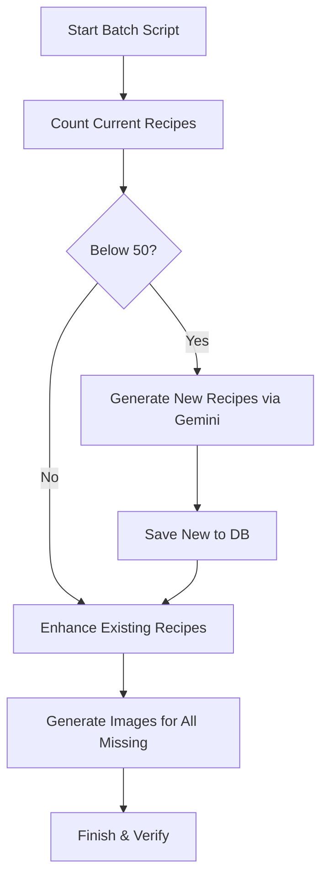

# Recipe Library Expansion & "Chef-Style" Enhancement Design

> **Status:** Draft
> **Author:** Antigravity
> **Date:** 2026-03-28

## Goal

The objective is to expand the Feast AI recipe library to 50+ high-quality recipes, ensuring each dish features a professional "Retro-Modern Cookbook" description, detailed ingredient context, refined "Chef-level" cooking instructions, and high-quality AI-generated imagery. Additionally, UI bugs regarding duplicate tags and interactive buttons will be resolved.

## Proposed Changes

### 1. Batch Expansion & Enhancement Script

A one-time utility script (`scripts/batch-enhance-recipes.ts`) will be created to manage the transformation of the library.

#### A. Data Generation

- **Expansion**: Identify the gap between current recipe count and the 50-recipe target.
- **Diversity**: Generate a list of recipe titles across Cambodian, Thai, Vietnamese, Malaysian, Indian, Italian, Mexican, Japanese, and Korean cuisines.
- **Gemini Prompting**: Use a "Professional Culinary Consultant" system instruction to generate:
  - **Prose**: Engaging, storytelling-driven descriptions for "About the Dish."
  - **Ingredients**: Enrichment of the `ingredientsJson` with specific quality notes (e.g., "farm-fresh," "heirloom").
  - **Steps**: Highly detailed, technique-focused instructions (e.g., "grind to a fine paste," "cold-pressed," "balance the acidity").

#### B. Image Generation

- **Prompting**: Each recipe will receive a dedicated image generation prompt based on its title and description.
- **Storage**: Generated images will be saved to `public/recipes/[id].webp` and the `imageUrl` in the database will be updated accordingly.

### 2. UI/UX Refinements

#### A. Tag Deduplication

- **Hero Section**: Keep the diet tags (e.g., Seafood, Gluten-Free) in the Hero section for immediate visibility.
- **Style Upgrade**: Update the Hero tags to use the "Brand Green Pill + Checkmark" style currently used in the "About" section.
- **Redundancy Removal**: Remove the tags from the "About the Dish" sub-section to prevent duplication.

#### B. Button Functionality Repairs

- **Add to Plan**: Ensure the `AddToPlannerModal` correctly receives the recipeID and title.
- **Save/Like**: Verify the `localStorage` token availability and API endpoint robustness in `app/recipes/[id]/page.tsx`.
- **Share**: Implement a "Copy Link" fallback for browsers not supporting `navigator.share`.

## Logic Flow

## Verification Plan

- **API Testing**: Manual verification of the interaction buttons (Save/Like/Plan).
- **Visual Audit**: Check the Recipe Detail page for tag deduplication and premium styling.
- **Data Audit**: Query the DB to ensure 50+ records exist with non-empty `imageUrl` and detailed `stepsMd`.
